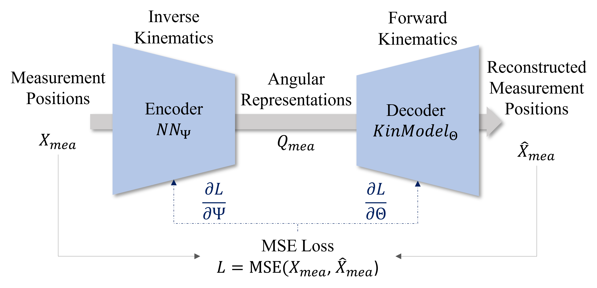

# Accurate Kinematic Modeling using Autoencoders on Differentiable Joints

This repository contains the research and implementation of a novel approach to kinematic optimization using autoencoders, with a focus on the hand and knee joints. The methodology leverages advanced regularization techniques, including Independent Component Analysis (ICA) and Variational Autoencoder (VAE), to ensure robustness and generalizability.

## Abstract

We present a novel approach to kinematic optimization using autoencoders. Our model is capable of simultaneously solving the forward and inverse kinematics solutions for any given model and dataset. We've validated our approach on two distinct joints: the hand and the knee. Our findings highlight the model's ability to interpret joint limitations, especially in the knee with reduced degrees of freedom. The architecture is simple yet efficient, offering a fresh perspective on kinematic optimization.

## How to Use

- Install the "requirements.txt"
- Modify the respective config file as desired for your train run.
- Run "python src/diff_joints.py"

## Results 

## Key Figures

<table>
  <tr>
    <td>
      
       
      <em>Figure 1: Overview of the autoencoder architecture for kinematics.</em>
    </td>
    <td>
      
       
      <em>Figure 2: Forward Kinematics Model Visualization.</em>
    </td>
  </tr>
</table>

## Key Findings

- The AE+ICA variant, despite its sophisticated integration, exhibited the highest error among the three models tested on the hand testbench.
- For models with multiple independent axes operating solely in 1 DOF, the AE+ICA variant proves counterproductive.
- All models consistently identified the knee joint's flexion axis as paramount, mirroring established biomechanical insights.

## Limitations

- Reliance on a single dataset for validation.
- Assumptions regarding joint constraints and movement redundancies might impact generalizability.

## Conclusion

Our findings underscore the potential of autoencoders in kinematic optimization, particularly when enhanced with ICA and VAE regularization techniques. The study offers a fresh perspective, potentially paving the way for more advanced and precise kinematic models in the future.

## References

Please refer to the paper for a comprehensive list of references.
